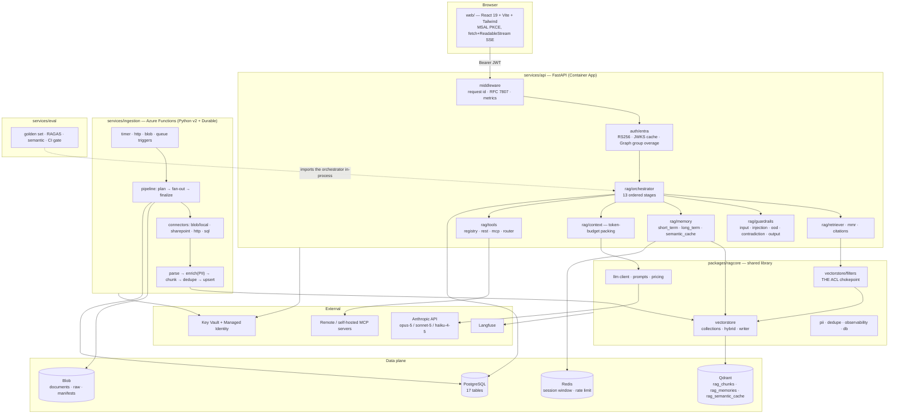

# productionizing-rag

A multi-tenant, ACL-aware RAG platform built to a written interface spec
(`docs/CONTRACTS.md`): hybrid retrieval over Qdrant, serverless delta ingestion on
Azure Functions, an agentic FastAPI chat surface backed by Anthropic Claude, and a
React client.

**Status.** The retrieval, guardrail, context, memory, tool, ingestion and API layers
are implemented and unit-tested (632 tests, all in-process, ~9 s). Four things are
known-broken or scaffolded and are called out where they matter:
`make bootstrap` / `make seed` / `make smoke` point at filenames that do not exist,
the evaluation gate cannot resolve its pipeline target, `/metrics` serves nothing
because `prometheus-client` is not installed, and ~122 documented tunables are
compile-time constants rather than environment variables. See
[`docs/FEATURE_MAP.md`](docs/FEATURE_MAP.md) for the full production-ready vs
scaffolded breakdown.

## The ten capabilities, one line each

| # | Capability | One line |
|---|---|---|
| 1 | Multi-tenant ACL ingestion, serverless, nightly delta | Four real connectors (Blob/local, SharePoint Graph delta, HTTP crawler, SQL watermark) fan out through Durable Functions on a 02:30 NCRONTAB timer, refuse to run inside working hours, and write tenant/role/group/deny/classification onto every chunk payload. |
| 2 | Personalisation, long-term memory, fast similar-query retrieval | Salience-weighted dense recall from `rag_memories` with decay, TTL and a hard consent gate, plus a semantic cache that stores the retrieval *plan* (chunk ids) — never an answer — so every reuse is re-authorised against the live ACL filter. |
| 3 | Efficient in-session context management | `context.py` packs to a token budget measured with Claude's own `count_tokens` (never a chars/4 heuristic), in priority order, and sheds by marginal value per token with an audited reason for every drop. |
| 4 | API / MCP tool calling for un-indexed data | A declarative YAML registry of REST tools plus remote MCP (Anthropic connector) and self-hosted MCP (official SDK), behind one dispatcher that enforces tenant, role, loop, rate-limit, classification-egress and PII gates in that order. |
| 5 | Short-term memory and periodic suppression | A Redis-backed session window (in-process fallback) that suppresses rather than truncates: old turns fold into a rolling summary every 6 turns *and* at 75 % of budget, stale tool results are cleared with the `clear_tool_uses_20250919` context edit. |
| 6 | Hybrid semantic + BM25 + rerank + metadata filtering | Dense `bge-m3` and sparse `Qdrant/bm25` prefetch branches fused **server-side** by the Qdrant Query API (RRF or DBSF), then simhash dedupe, `bge-reranker-v2-m3` cross-encoder, MMR and a per-document cap. |
| 7 | React interface | Vite + React 19 + Tailwind + MSAL: streaming chat, retrieval inspector, source drawer, citation list, context meter, guardrail banner, tool trace, memory panel, admin documents/ingestion and an eval dashboard. |
| 8 | RAGAS + semantic-similarity validation vs a golden set | 59 golden items over six categories run through the real pipeline, scored with RAGAS (or native Claude judges) plus bge-m3 cosine, gated in CI with two hard floors. **Currently cannot execute — see the caveat below.** |
| 9 | PII, OOD, contradictions, dedupe, citations, lineage, Langfuse | Presidio-or-regex PII with redact-before-log enforced by a structlog processor, an out-of-domain gate with score-collapse detection, recency/authority contradiction resolution that cites both sides, span-verified citations and lineage rows per turn. |
| 10 | Query transformation | One `claude-sonnet-5` structured call produces intent, rewrite, sub-questions, HyDE passage, extracted facets and an out-of-domain flag — and never raises: every failure degrades to a documented fallback plan. |

## Component diagram



## Quickstart from a clean clone

Prerequisites: Python 3.13 + [uv](https://docs.astral.sh/uv/), Node 20.19+ (CI uses
25), Docker for the local data plane.

```bash
# 1. environment + workspace
make setup                       # cp .env.example .env; uv sync --all-packages --all-groups

# 2. data plane (Qdrant, PostgreSQL, Redis, Langfuse + its ClickHouse/MinIO)
make up                          # waits for qdrant/postgres/redis to report healthy

# 3. schema
make migrate                     # alembic -c packages/ragcore/ragcore/db/alembic.ini upgrade head

# 4. Qdrant collections + payload indexes    ⚠ make bootstrap is broken, use this:
uv run python scripts/bootstrap_qdrant.py

# 5. demo tenants, personas and the golden corpus   ⚠ make seed is broken, use this:
uv run python scripts/seed_demo_tenant.py --purge

# 6. API on http://localhost:8000  (docs at /docs)
make api

# 7. web on http://localhost:5173  (separate shell)
make web

# 8. end-to-end check incl. ACL negatives   ⚠ make smoke is broken, use this:
uv run python scripts/smoke_test.py --base-url http://localhost:8000
```

### Known-broken Makefile targets

`docs/CONTRACTS.md` Addendum I says the Makefile "must point at these four paths;
earlier drafts referenced shorter names that do not exist". The Makefile still has the
earlier draft names, so three targets fail immediately:

| Target | Invokes | Actual script |
|---|---|---|
| `make bootstrap` | `scripts/bootstrap.py` ❌ | `scripts/bootstrap_qdrant.py` |
| `make seed` | `scripts/seed.py` ❌ | `scripts/seed_demo_tenant.py` |
| `make smoke` | `scripts/smoke.py` ❌ | `scripts/smoke_test.py` |

`make setup`, `make up`, `make migrate`, `make api`, `make web`, `make ingest-local`,
`make lint`, `make test` all work as written. Use the explicit `uv run python
scripts/…` commands above until the Makefile is corrected.

The first `make api` (or first ingestion run) downloads the FastEmbed weights for
`BAAI/bge-m3`, `Qdrant/bm25` and `Xenova/bge-reranker-v2-m3` into
`RAG_EMBEDDING_CACHE_DIR` (~2.5 GB, several minutes). Startup never aborts on a
failure — check `GET /readyz`, not `GET /health`, for dependency state.

## Environment variables that must be set

Everything is a `RAG_`-prefixed field on `ragcore.settings.Settings`; `.env.example`
documents all 208 of them and every one is a real field. These are the ones with no
usable default:

| Variable | Why |
|---|---|
| `RAG_ANTHROPIC_API_KEY` | Every model call. Omit only to let the SDK resolve `ANTHROPIC_API_KEY`. Without a key, query transform, enrichment, contradiction adjudication and generation degrade or fail. |
| `RAG_ENTRA_TENANT_ID` · `RAG_ENTRA_CLIENT_ID` | Token issuer and expected audience. Without them the API cannot validate a real JWT (`auth_not_configured`). |
| `RAG_QDRANT_URL` (+ `RAG_QDRANT_API_KEY` off-localhost) | The vector store. |
| `RAG_POSTGRES_HOST` / `_USER` / `_PASSWORD` / `_DB` | Sessions, messages, documents, lineage, audit. Or set `RAG_DATABASE_URL_OVERRIDE`. |
| `RAG_PII_HASH_SECRET` | HMAC key for `hash`-mode redaction. It is a **join key**: change it and previously redacted values stop matching. The shipped value is a placeholder. |
| `RAG_ENV` | `local` \| `dev` \| `staging` \| `production`. `production` makes `Settings` refuse to construct when `entra_dev_mode` or `tool_allow_insecure_http` is true, and turns `/docs` off. |

Local-only, must never reach production:

| Variable | Effect |
|---|---|
| `RAG_ENTRA_DEV_MODE=true` | Accepts an unsigned `x-dev-principal` header instead of a JWT. `Settings` refuses to construct, and the API refuses to start, when this is on with `RAG_ENV=production`. |
| `RAG_TOOL_ALLOW_INSECURE_HTTP=true` | Permits non-HTTPS REST tool targets. Same production refusal. |

Optional but load-bearing: `RAG_LANGFUSE_ENABLED` + `RAG_LANGFUSE_PUBLIC_KEY` +
`RAG_LANGFUSE_SECRET_KEY` (tracing degrades to a no-op without all three),
`RAG_REDIS_ENABLED` (session window and rate limiter degrade to in-process),
`RAG_RERANK_ENABLED=false` (swaps in `NoopReranker` for cheap CI),
`RAG_PII_USE_PRESIDIO=false` (regex-only recognisers; Presidio is the `pii` extra:
`uv sync --extra pii`).

Browser variables are `VITE_*` only and are read at build time — see the `# web`
block of `.env.example` and `web/.env.example`.

## Running the eval gate

```bash
uv run python -m eval.run --golden services/eval/golden/golden_set.yaml --gate
# or: make eval        (this target's path is correct)
```

**This currently fails.** The harness resolves `eval_pipeline_target`, whose default
is `app.rag.orchestrator:run_turn`; the orchestrator module exposes
`Orchestrator.run`, `Orchestrator.stream` and `get_orchestrator`, but no module-level
`run_turn`. The run aborts with:

```
EvalHarnessError: 'app.rag.orchestrator:run_turn' is not callable
```

exit code 2 ("the harness could not run"). There is **no environment override**:
`eval_pipeline_target` is not a `Settings` field and `Settings` is configured
`extra="ignore"`, so `RAG_EVAL_PIPELINE_TARGET` is silently discarded. The two ways
to run it today are to add a `run_turn(*, message, principal, …)` coroutine to
`app/rag/orchestrator.py`, or to call `run_eval(runner=…)` in process with your own
`PipelineRunner`. Everything downstream of the runner — scoring, the gate, the
JSON/Markdown/HTML reports, the baseline comparison — is implemented and unit-tested.

Related: `POST /api/v1/eval/runs` answers `503 eval_unavailable` because it imports
`eval.harness.run_evaluation`, and `services/eval/harness.py` does not exist.

See [`docs/EVALUATION.md`](docs/EVALUATION.md) for the golden-set schema, every metric
and the gate thresholds.

## Checks

```bash
make lint        # ruff check + ruff format --check   (clean)
make test        # pytest across every workspace member (632 pass, ~9 s)
make typecheck   # mypy (not run by CI)
```

CI (`.github/workflows/ci.yml`) runs five jobs: `lint`, `test` (with live Postgres and
Qdrant services and `--cov-fail-under=70`), `bicep` (compile + linter-warnings-as-errors
+ shellcheck), `web` (typecheck + production build) and `eval` (the gate — see above).

## Documentation

| Document | Contents |
|---|---|
| [`docs/CONTRACTS.md`](docs/CONTRACTS.md) | The authoritative interface spec everything was written against. |
| [`docs/ARCHITECTURE.md`](docs/ARCHITECTURE.md) | Request lifecycle, ingestion lifecycle, Qdrant design and why, context/memory design, tool execution model. |
| [`docs/SECURITY.md`](docs/SECURITY.md) | Threat model, tenant isolation enforcement points, ACL truth table, PII at every hop, injection, secrets, residual risks. |
| [`docs/OPERATIONS.md`](docs/OPERATIONS.md) | Bicep deploy, ingestion schedule, monitoring, scaling and cost, backup/restore, five-failure runbook. |
| [`docs/EVALUATION.md`](docs/EVALUATION.md) | Golden-set schema, metrics, gate thresholds, adding an item, baselines, reading the report. |
| [`docs/FEATURE_MAP.md`](docs/FEATURE_MAP.md) | Requirement → files/functions/tests, with an honest production-ready vs scaffolded column. |

Where this documentation and `docs/CONTRACTS.md` disagree, **this documentation
describes what the code does** and says so explicitly; the contract describes what it
was supposed to do.
