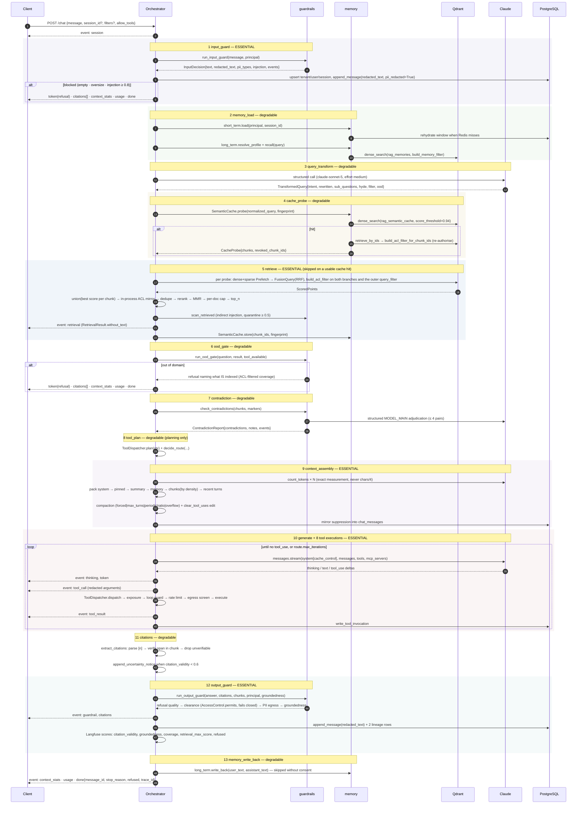
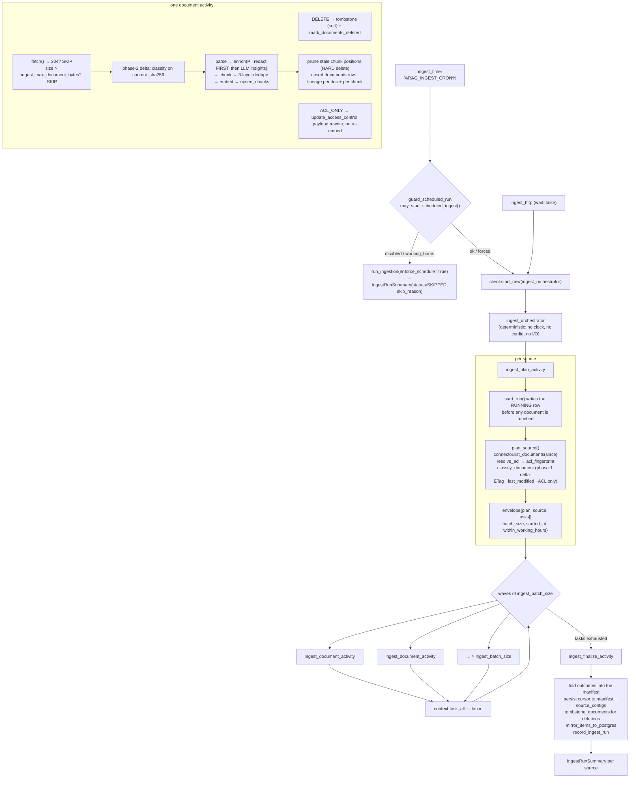

# Architecture

What the code in this repository actually does. Where behaviour diverges from
`docs/CONTRACTS.md`, the divergence is stated inline and marked **⚠ divergence**.

Every threshold quoted here is the value that is really in force at runtime. Some
come from `ragcore.settings.Settings` (operator-configurable via `RAG_*` environment
variables); others come from one of six in-code default tables and are **not**
configurable — those are marked `(constant)`. See
[Configuration reality](#configuration-reality) at the end.

---

## 1. Request lifecycle

`POST /api/v1/chat` is the only endpoint that runs the full pipeline. Both the
streaming and the non-streaming form drive the same private async generator
(`Orchestrator._pipeline`); `stream()` forwards its `SSEMessage` values, `run()`
drains them and projects the accumulated `TurnState` onto a `ChatTurn`. There is no
second implementation of any stage.

### Before the pipeline

1. **`RequestContextMiddleware`** (pure ASGI, deliberately not `BaseHTTPMiddleware`,
   which would buffer the SSE body) assigns or echoes `x-request-id`, binds
   `request_id`/`route` into structlog, stamps `x-trace-id`, and calls
   `observe_http_request` with the route **template**.
2. **`app.deps.get_principal`** → `EntraTokenValidator.principal_for_header`
   validates the RS256 JWT against the cached Entra JWKS and resolves a `Principal`
   (`oid`, `tid`, `roles`, `groups`, derived `max_classification`). It binds
   `tenant_id`/`user_id` into structlog — ids only, never email or display name.
3. **`app.deps.enforce_rate_limit`** applies a `(tenant_id, user_id)` token bucket
   (`api_rate_limit_per_minute=60`, burst 20 `(constant)`), Redis-backed with an
   in-process fallback.
4. **`app.routers.chat`** returns a `StreamingResponse(media_type="text/event-stream")`
   with `cache-control: no-cache, no-transform`, `connection: keep-alive` and
   `x-accel-buffering: no` (which is what stops `web/nginx.conf` batching tokens),
   opens with one `retry:` frame, and merges the pipeline's events with a heartbeat
   timer through an anyio memory object stream.

### The 13 stages

`STAGES` in `app/rag/orchestrator.py` is the ordered tuple of span and metric names:

```
input_guard · memory_load · query_transform · cache_probe · retrieve · ood_gate ·
contradiction · tool_plan · context_assembly · generate · citations · output_guard ·
memory_write_back
```

Each stage runs inside `Orchestrator._stage(name, state, essential=…)`, which times
it, records `observe_pipeline_stage`, and — for a **non-essential** stage — converts
any exception into a `GuardrailEvent(action="warn")` on the `guardrail` SSE event and
continues. Essential stages (`input_guard`, `retrieve`, `context_assembly`,
`generate`, `output_guard`) propagate.



**⚠ divergence (ordering).** The contract numbers the tool loop as stage 8 and
generation as stage 10. In the code, stage 8 is *planning* only
(`ToolDispatcher.plan` + `decide_route`), which runs before assembly; the tool
**executions** interleave with stage 10's streamed generation, each dispatch in its
own `tool.<name>` Langfuse span. This is documented in the orchestrator's own module
docstring and is the only way an agentic loop can work — the prompt must exist first.

### Invariants worth relying on

* **Every exit emits `context_stats`, `usage` and `done`.** A guardrail block and an
  OOD refusal stream their operator-authored answer as `token` events, then
  `citations: []`, then the three closing events. `done` always carries `message_id`,
  which is what lets the UI attach feedback to a persisted turn.
* **A failure after the first byte becomes an `error` event followed by `done`**, not
  an HTTP status — a half-open stream has no status left to carry it.
* **The turn opens its own `session_scope()`** when no session is injected, so a
  streaming body outlives the handler safely. Each persistence step commits
  independently and rolls back on failure (`Orchestrator._persist`), because a
  SQLAlchemy session that has seen an error refuses every later statement.
* **A database outage degrades the turn to "answered but not recorded"** — every
  persistence call tolerates `session is None` and emits a warning guardrail event.

### Retrieval detail (stage 5)

`app/rag/retriever.retrieve` order, from the code:

1. Build probes: `rewritten` first, then sub-questions (capped at
   `qt_max_subqueries + 1 = 4`), plus the HyDE passage. De-duplicated
   case-insensitively; `queries_used` lists every probe actually issued.
2. Embed all probes once (`bge-m3` dense + `Qdrant/bm25` sparse, thread-offloaded).
   If **all** embeddings fail → `RetrievalError` (503). Returning empty would look
   identical to an out-of-domain query, and the OOD gate would tell the user the
   corpus does not cover it — an embedder outage is not a coverage answer.
3. One `build_acl_filter(principal, filters)` result, applied to **both** prefetch
   branches and the outer `query_filter`. Redundant by design.
4. `hybrid_search` per probe: `Prefetch(using="dense")` + `Prefetch(using="sparse")`
   → `FusionQuery(Fusion.RRF)`. A None or empty sparse vector (a stop-word-only
   query) drops the sparse branch rather than sending an empty `SparseVector`, which
   would match nothing.
5. `_union`: best fusion score per chunk across probes. Each candidate passes the
   **in-process ACL mirror** — `payload.tenant_id == principal.tenant_id` and
   `AccessControl.permits(principal)`. A failure is counted and logged at **error**
   level and the chunk is discarded; `DROP_ACL = "acl"` is deliberately never placed
   in `RetrievalResult.dropped`, because that object is serialised to the client and
   would leak the title, URI and section path of a document the caller may not see.
6. `dedupe_chunks` — exact `content_sha256` then banded simhash at
   `dedupe_max_distance=3`. Drop reasons `duplicate:sha256`,
   `duplicate:simhash:<distance>`.
7. Cross-encoder rerank of at most `rerank_candidate_limit=50` candidates
   (`rerank:candidate_limit`), `rerank_min_score` (default `None` = no floor),
   `rerank_top_n=8` (`rerank:top_n`). A rerank failure degrades to fusion order.
8. MMR (`retrieval_mmr_lambda=0.7`) reading candidate vectors back through
   `build_acl_filter_for_chunk_ids` — even that bookkeeping read is tenant-scoped —
   re-embedding anything the read missed.
9. Per-document cap `retrieval_max_per_document=3` (`max_per_document`), then
   `retrieval_top_n=8` (`top_n`).

`final_score` is always in `[0,1]`: `sigmoid(rerank_score)` with a real cross-encoder,
otherwise `min(1, fusion_score / retrieval_fusion_score_scale)` where the scale is
`0.05 (constant)`. `dense_score`/`sparse_score` stay `None` on the fused path —
fusion happens server-side, so per-branch scores never leave Qdrant.
`latency_ms` buckets: `embed`, `search`, `dedupe`, `rerank`, `vectors`, `mmr`, `total`.

---

## 2. Ingestion lifecycle

`services/ingestion` is an Azure Functions app (Python v2 programming model +
Durable Functions). `function_app.py` contains **no ingestion logic**: every trigger
unpacks its input, calls `ingestion.pipeline`, and serialises the result, so the
nightly Azure run, the admin trigger and the local CLI execute identical code.

### Triggers

| Function | Trigger | Behaviour |
|---|---|---|
| `ingest_timer` | timer `%RAG_INGEST_CRON%` (six-field NCRONTAB, default `0 30 2 * * *`) | Evaluates `guard_scheduled_run` first. On refusal it calls `run_ingestion(enforce_schedule=True)` so a **skipped** run row with a `skip_reason` is recorded, then returns. Otherwise starts the orchestrator. |
| `ingest_http` | `POST /api/ingest/trigger` | Body: `tenant_id`, `source_id`/`source_ids`, `force`, `full_scan`, `dry_run`, `wait`, `enforce_schedule`. `wait=true` runs inline (`run_ingest` for one tenant, `run_ingestion` across tenants); otherwise starts the orchestrator and returns the Durable status URLs. |
| `ingest_orchestrator` | orchestration | Plan activity → waves of `ingest_batch_size` document activities → finalise activity, one summary per source. |
| `ingest_plan_activity` · `ingest_document_activity` · `ingest_finalize_activity` | activity | The three pipeline phases. |
| `ingest_blob` | blob `%RAG_AZURE_BLOB_CONTAINER%/{name}` | Single-document ingestion the moment a blob lands. The owning source is resolved by **longest matching prefix**; `.acl.json` sidecars are ignored. |
| `ingest_retry` | queue `%RAG_AZURE_STORAGE_QUEUE_NAME%` | Either a full serialised `DocumentTask` (retry one document without replanning) or `{tenant_id, source_id, source_uri, force?}` (reindex one). |

Three settings are consumed as **binding expressions** and must exist as app
settings, not only in `.env`, or the host refuses to index the functions:
`RAG_INGEST_CRON`, `RAG_AZURE_BLOB_CONTAINER`, `RAG_AZURE_STORAGE_QUEUE_NAME`.

### Durable fan-out



### Two-tier delta, and why a re-run writes nothing

* **Phase 1 (`plan_source` → `classify_document`)** decides on listing metadata only:
  ETag, `last_modified` and the ACL fingerprint. A provably unchanged document is
  never downloaded.
* **Phase 2 (`_process`)** re-classifies on the **content hash** once the bytes are in
  hand, so a file that was touched, copied or re-uploaded without being edited is
  skipped before parsing or embedding.

Reason strings, which land in `ingest_items.reason`: `new`, `content_changed`,
`unchanged`, `unchanged_touched`, `acl_changed`, `deleted_at_source`, `forced`,
`not_modified`, `reappeared`, `missing_from_full_scan`.

**Deletion detection requires a full scan.** A SharePoint `deltaLink` pass or a SQL
watermark pass deliberately does not mention unchanged documents, so
`detect_deletions` returns `[]` unless `connector.performed_full_scan` is true. That
is what `--full-scan` / `full_scan: true` is for: it clears the stored cursor so
enumeration is complete and deletion detection becomes sound again.

### Idempotency

* `document_id = sha256(tenant_id \x00 source_uri)[:32]`
* `chunk_id = f"{document_id}::{index:04d}"` — positional, contiguous from zero
  **after** dedupe, and readable enough that a golden item can name one
* Qdrant point id = `uuid5(POINT_ID_NAMESPACE, chunk_id)` via `point_id_for_chunk`
* the `documents` row is an upsert; manifest folding is last-write-wins per document
* `start_run` writes the `running` row *before* any document is touched

A Durable activity retry, a re-queued document or a re-run of a failed run therefore
repeats work rather than duplicating it.

### Connectors

| Connector | Delta signal | ACL source |
|---|---|---|
| `AzureBlobConnector` | blob ETag + `last_modified`; the listing carries metadata and index tags | `<name>.acl.json` sidecar → blob metadata (`acl_*`) → index tags → source defaults |
| `LocalFilesystemConnector` | synthetic `st_size`-`st_mtime_ns` ETag; `include_globs`/`exclude_globs` | `<name>.acl.json` sidecar → source defaults |
| `SharePointConnector` | Graph `/drives/{id}/root/delta`, `@odata.deltaLink` persisted as the cursor | Graph `/items/{id}/permissions` → Entra group/user object ids; org-wide links leave the document unrestricted |
| `HttpCrawlerConnector` | `If-None-Match` / `If-Modified-Since`; 304 → skip. `robots.txt` honoured per host, bounded by `ingest_http_max_pages=500` and `ingest_http_concurrency=4`, off-domain URLs never fetched | source config only — a web page has no ACL |
| `SqlSourceConnector` | `watermark_column`, always a `:watermark` **bind parameter**; the column name is identifier-validated | per-row `acl_*` columns merged with source defaults; a row whose `tenant_column` disagrees with the source is **dropped, not indexed** |

`SharePointConnector` and `SqlSourceConnector` set `supports_delta = True` and advance
`.cursor`; the other three are primed with the previous run's manifest entries through
`prime_delta_state()` and do conditional requests.

### Manifests

`<tenant_id>/<source_id>.json` in `ingest_manifest_container` (Blob) or under
`dirname(ingest_local_root)/<container>/` locally — tenant-first, so the container is
already tenant-partitioned. `BlobManifestStore` writes are ETag-conditioned and
merge-and-retry on a 412. A corrupt or foreign-tenant manifest **degrades the run to a
full rescan**; it never fails it.

### Three-layer dedupe

`ingestion.upsert.RunUpserter`:

1. exact `content_sha256` within the run;
2. exact `content_sha256` against the tenant's already-indexed corpus, via the
   `content_sha256` payload index — this is what makes cross-document dedupe survive
   the Durable fan-out, where each activity is a separate process;
3. banded simhash LSH within the run at `dedupe_max_distance=3`.

Drop reasons: `duplicate_exact_run`, `duplicate_exact_corpus`, `duplicate_simhash`,
`empty_after_normalisation` (counted in `drop_reasons` but **not** in
`duplicates_dropped`). Chunks below `dedupe_min_chunk_chars=64` opt out of the
simhash layer by carrying a blank fingerprint, which never compares equal.

**Pruning hard-deletes; document deletion tombstones.** After an upsert, chunk
*positions* the document no longer has are purged with `hard_delete_by_filter` — they
are stale rows of a document being replaced. A document that disappeared at source
goes through `soft_delete_document`, which sets `is_deleted=True` and keeps the
lineage.

### Dry run

`dry_run=True` enumerates, resolves ACLs, fetches, parses, PII-scans, chunks and
dedupes for real and writes nothing: no Qdrant client is opened, no
`documents`/`ingest_runs`/`ingest_items` row is written, the manifest is read but
never saved. Enrichment is skipped (no LLM spend); **the PII scan still runs**. The
summary is a projection — `documents_*` say what the run *would* do,
`chunks_upserted`/`tokens_embedded` stay 0, and the would-be totals are in `metrics`
as `chunks_planned`, `tokens_planned`, `deletions_planned` alongside
`metrics["dry_run"] == 1.0`.

---

## 3. Qdrant collection and payload-index design, and why

`packages/ragcore/ragcore/vectorstore/collections.py`. `ensure_collections` is
idempotent, tolerates a concurrent creator (HTTP 409 and the local backend's
`ValueError`), skips indexes that already exist, and logs `created` vs `found`.

### Three collections

| Collection | Vectors | Payload indexes |
|---|---|---|
| `rag_chunks` | named `dense` (1024-d, COSINE) **and** named `sparse` (`SparseVectorParams(modifier=Modifier.IDF)`) | 17 (below) |
| `rag_memories` | named `dense` only | `tenant_id` (`is_tenant`), `user_id`, `kind`, `expires_at` |
| `rag_semantic_cache` | named `dense` only | `tenant_id` (`is_tenant`), `user_id`, `filter_fingerprint` |

All three carry a single **named** dense vector called `dense` — never an unnamed
default vector — so every query in the platform passes `using=DENSE` regardless of
which collection it targets, and every upsert uses `vector={DENSE: [...]}`.

### Why `is_tenant=True` plus `hnsw m=0` / `payload_m`

Qdrant's documented multitenancy pattern is to disable the **global** HNSW graph
(`m=0`) and let it build **per-tenant subgraphs** instead (`payload_m=16`), then mark
the tenant field's keyword index with `is_tenant=True` so Qdrant co-locates a tenant's
points on disk.

The reason this matters is more than performance. With a single global graph, a
tenant-filtered search traverses the whole graph and discards non-matching neighbours;
under a restrictive filter that degenerates into an expensive scan, and the engine's
behaviour under filtering becomes the thing standing between tenant A and tenant B's
vectors. With per-tenant subgraphs the traversal never enters another tenant's
region in the first place: the physical layout is aligned with the security boundary
instead of merely being filtered by it. Both knobs are settings
(`qdrant_hnsw_m=0`, `qdrant_hnsw_payload_m=16`, `qdrant_hnsw_ef_construct=128`).

`_ensure_payload_indexes` warns loudly (`qdrant.index.tenant_not_partitioned`) when an
existing `tenant_id` index lacks `is_tenant=True`: such a collection predates the
pattern, searches will not use the per-tenant subgraph, and the only fix is to
recreate the collection.

### Why `Modifier.IDF` on the sparse vector

`Qdrant/bm25` emits **raw term frequencies** and relies on Qdrant to apply the
inverse-document-frequency term at query time. A collection created without
`modifier=Modifier.IDF` silently scores term frequency only — which looks exactly
like a working BM25 branch while ranking badly, because every common word counts as
much as a rare one. This is the single easiest thing to get wrong in a hybrid setup,
and it is unrecoverable without recreating the collection.

Correspondingly, documents go through FastEmbed `embed` and queries through
`query_embed`. For BM25 these genuinely differ; embedding a query with `embed`
double-weights terms because Qdrant applies IDF again.

### Why server-side RRF

`hybrid.hybrid_search` issues **one** Query API request with two `Prefetch` branches
(dense `using="dense"`, sparse `using="sparse"`), each carrying the same
`qfilter`, fused by `FusionQuery(fusion=Fusion.RRF)` (or `DBSF` when
`retrieval_fusion="dbsf"`). Nothing is fused in Python. Three consequences:

* **Filtering and scoring stay in the engine.** Fusing client-side would mean
  over-fetching from both branches and re-applying limits in Python, where the ACL
  filter is no longer the thing bounding the candidate set.
* **One round trip** instead of two, per probe.
* The `qfilter` is set on both prefetch branches **and** on the outer `query_filter` —
  redundant on purpose, so the tenant boundary survives an edit to either layer.

### The 17 `rag_chunks` payload indexes

`tenant_id` (keyword, `is_tenant=True`), `allowed_roles`, `allowed_groups`,
`allowed_users`, `denied_users`, `classification_rank` (integer with `range=True`,
because the ACL filter range-filters it), `document_id`, `source_type`, `doc_type`,
`tags`, `language`, `author`, `is_deleted` (bool), `content_sha256`,
`source_modified_at` (datetime), `section_path`, `pii_types`.

Every field the ACL filter and the `MetadataFilter` touch is indexed. An unindexed
clause forces Qdrant to scan payloads, which is precisely what must not happen on the
tenant boundary. Note what is **not** indexed: `chunk_id`. The cache re-fetch path
uses `HasIdCondition` over the derived point ids, which is indexed by construction.

`ChunkPayload` is deliberately **flat** — nested objects cannot be payload-indexed, so
the six ACL fields plus the denormalised `classification_rank` live at the top level.
`from_access_control` is the only supported way to populate them (ACL keys in
`**fields` are overwritten by the `AccessControl`, so a caller cannot desynchronise
them), and a model validator re-derives `classification_rank` from `classification`.

### Point ids

Qdrant accepts only unsigned integers and UUIDs, but `chunk_id`, `memory_id` and
`cache_id` are opaque strings. `stable_point_id` returns a value that already parses
as a UUID in canonical form and otherwise hashes with UUIDv5 under a fixed namespace.
The mapping is deterministic, which is what makes re-ingesting a chunk an **upsert**
rather than a duplicate. Nothing ever reads the point id back — the logical id is
always in the payload.

---

## 4. Context management and memory

### Token budget (all real settings)

| Setting | Default | Derived |
|---|---|---|
| `context_budget_tokens` | 120 000 | |
| `context_reserve_output_tokens` | 16 000 | `context_prompt_budget_tokens` = **104 000** |
| `context_compact_at_ratio` | 0.75 | `context_compact_threshold_tokens` = **78 000** |
| `context_retrieved_budget_ratio` | 0.55 | retrieved sub-budget ≈ **57 200** |
| `context_memory_budget_ratio` | 0.08 | memory sub-budget ≈ **8 320** |
| `context_summary_max_tokens` | 1 200 | |
| `context_max_history_turns` | 20 | |
| `context_min_live_turns` | 4 | the floor that is never compacted |
| `context_tool_result_ttl_turns` | 3 | |
| `context_compact_every_n_turns` | 6 `(constant)` | periodic suppression |
| `context_min_retrieved_chunks` | 1 `(constant)` | kept under extreme pressure |
| `context_duplicate_penalty` | 0.35 `(constant)` | novelty multiplier for a near-duplicate |
| `context_fit_max_passes` | 3 `(constant)` | exact-measurement shed passes |
| `context_cache_history_min_tokens` | 1 024 `(constant)` | second cache breakpoint threshold |

### Nothing is estimated

Every count comes from `LLMClient.count_tokens` — Claude's own tokenizer — through
`short_term.TokenCounter`, memoised by content digest (LRU, `4096` entries
`(constant)`). The system prompt is measured by differencing two exact counts against
a constant probe message; each candidate block is measured on its own; the finished
payload is measured once, and that number is `ContextStats.window_tokens`. `tiktoken`
appears nowhere. When the count API is unreachable after retries, `count_tokens`
degrades to a characters/4 estimate **and logs**, so assembly cannot hard-fail.

### Packing and shedding

Packing order (contract stage 9): system prompt → pinned turns → rolling summary →
long-term memory → retrieved chunks → recent turns. Chunks are *selected* by
`density = (final_score × novelty) / tokens` but *rendered* in relevance order, so
`[n]` markers stay meaningful.

`rank_sources` is dedup-aware before packing even starts: an exact `content_sha256`
repeat is dropped outright (`context:duplicate:sha256`); a simhash near-duplicate of
an already-packed chunk keeps only `0.35` of its score, which makes it the first thing
shed (`context:duplicate:simhash`).

Shedding order once the exact measurement overshoots: near-duplicate / low-density
chunks above `context_min_retrieved_chunks` → memory lines → the remaining chunks →
non-pinned history turns → the rolling summary. Pinned turns are never shed. Nothing
is cut mid-sentence and every drop carries a `dropped_reason`.

### Compaction triggers

`ContextAssembler._compaction_reason` returns, in order:

| Reason | Condition |
|---|---|
| `""` | `len(live_turns) <= context_min_live_turns` — the floor is never compacted, so `force_compaction` on a short session is a no-op |
| `forced` | caller demanded it (`POST /sessions/{id}/compact`) |
| `max_turns` | `live > context_max_history_turns` (20) |
| `periodic` | `turns_since_compaction >= 6` — **requirement #5's periodic suppression**, fires even when the budget is nowhere near full |
| `ratio` | projected prompt `>= 78 000` tokens |
| `overflow` | (set separately by `_suppress_overflow`) turns packing could not fit |

Suppression folds retired turns into a rolling summary via `summarise_turns`
(`claude-sonnet-5`), which **never fails a turn**: a refusal, an unreachable API or a
missing key falls back to a deterministic extractive summary. Retired turns stay in
`chat_messages` with `suppressed=True` and stay visible in the UI —
`repositories.suppress_messages` itself refuses to suppress a pinned turn.

### Tool results

`ContextStats.tool_results_cleared` counts the tool calls on live turns older than
`context_tool_result_ttl_turns`, and `context_management` is set to
`clear_tool_uses_edit()` (beta `context-management-2025-06-27`, edit
`clear_tool_uses_20250919`) whenever that count is non-zero. Replayed history is
rendered as plain text, so the assembler re-sends nothing stale either; the edit is
what clears the blocks the stage-8 tool loop appends to the same payload.

### Prompt caching

Volatile content — sources, memory, summary, preferences, the question — lives only
in the **final user turn** (`prompts.build_answer_user_turn`), never in the system
prompt, so the system prefix stays byte-stable across turns. One `cache_control`
breakpoint goes on the last system block, and a second on the last *stable* history
message once that prefix exceeds 1 024 measured tokens. `LLMClient` strips any
caller-supplied `cache_control` and re-places one breakpoint itself, so the two cannot
disagree. `ContextStats.cache_read_tokens`/`cache_write_tokens` are filled in by the
orchestrator from `response.usage` as the stream reports it.

### Message-sequence repair

Suppression can leave a history that starts on an assistant turn or contains two
consecutive same-role turns, both of which the Messages API rejects. Consecutive
same-role turns are merged, and a leading assistant turn is preceded by the constant
`GAP_NOTICE`. Nothing is discarded to make the sequence valid.

### Short-term memory (the session window)

`SessionWindow` holds live turns only; suppressed turns leave it. The store key is
`<redis_session_prefix><tenant_id>:<session_id>` — tenant first — and a cached window
whose `tenant_id` disagrees with the principal is **discarded and logged, never
returned**. Redis is optional: a missing `redis` package or a failed call degrades to
`InMemorySessionStore`, PostgreSQL re-hydration is authoritative, and the choice is
logged once at startup. `record_turn` raises `ValueError` unless `pii_redacted=True`,
exactly as `repositories.append_message` does.

### Long-term memory

`rag_memories`, one dense vector per memory, filtered by `build_memory_filter`
(tenant **and** user in `must`, so a memory can never surface for a different user
even on a perfect vector match).

| Setting | Default |
|---|---|
| `memory_top_k` | 6 |
| `memory_min_salience` | 0.25 |
| `memory_salience_decay_per_day` | 0.01 |
| `memory_salience_boost_on_hit` | 0.05 |
| `memory_max_per_user` | 500 |
| `memory_ttl_days` | 365 |
| `memory_dedupe_threshold` | 0.9 |
| `memory_profile_refresh_turns` | 10 |
| `memory_recall_similarity_weight` | 0.7 `(constant)` |
| `memory_recall_oversample` | 4 `(constant)` |
| `memory_profile_min_memories` | 3 `(constant)` |

Recall ranks by `0.7 × cosine + 0.3 × decayed_salience` after dropping anything below
`memory_min_salience` or past `expires_at`; selected memories are touched
(`hit_count`, `last_used_at`, `+0.05` salience), best-effort.

**The consent gate is hard and fails closed.** `consent_gate` returns
`"consent_unknown"` when no profile could be resolved (no `profile=` and no
`db_session=`), and *nothing* is read or written in that case. Defaulting the other
way would let a database hiccup silently re-enable memory for someone who switched it
off. `recall` and `write_back` both report the blocking reason, so "nothing stored"
and "not allowed to look" are distinguishable.

`remember` is the only write path and PII-scans and redacts before embedding or
upserting, so `pii_redacted=True` on a stored memory is an assertion the pass ran.
Deletes are ownership-checked: a Qdrant point id carries no tenant, so the point is
retrieved and its payload's `tenant_id`/`user_id` verified before removal. Growth is
bounded by `supersedes` (delete-then-write, no orphan), `expire()` and `prune()`.

### Semantic cache

`rag_semantic_cache` stores **only the plan** — `normalized_query`,
`transformed_queries`, `chunk_ids` (capped at `memory_cache_max_chunk_ids=32`),
`filter_fingerprint` and counters. Never the answer, and never chunk text. *An answer
cannot be re-authorised; a chunk id can.*

A hit requires cosine `>= memory_cache_threshold = 0.94` (enforced by Qdrant as a
`score_threshold` on the probe) **and** an exact `filter_fingerprint` match, and the
entry must not be past `memory_cache_ttl_seconds = 86 400`.

`filter_fingerprint` = `sha256(canonical_json({version, tenant_id, clearance_rank,
filter}))[:32]`. Group and role membership deliberately do **not** contribute: a
clearance change misses, a group change hits and is then caught by the live ACL
re-fetch — which is precisely the path that must be exercised. Cached ids become
chunks only through `build_acl_filter_for_chunk_ids`; ids the filter withheld are
reported in `CacheProbe.revoked_chunk_ids`, and a hit with zero survivors is reported
as a miss (`reason="empty_after_acl"`) so the pipeline retrieves normally instead of
answering from an empty plan.

Probe reasons observed in code: `hit`, `disabled`, `empty_query`, `below_threshold`,
`empty_after_acl`, `error`. Every outcome records
`observe_cache_lookup(cache="semantic", hit=…)`.

Eviction runs after every `store`, per `(tenant_id, filter_fingerprint)` bucket:
expired entries first, then the excess over `memory_cache_max_entries=500 (constant)`
ordered by `hit_count` then `last_used_at`.

---

## 5. Tool and MCP execution model

`services/api/app/rag/tools/`. Three transports behind one dispatcher.

### Registry

`build_registry` loads YAML or JSON from `tool_registry_path` or
`config/tools.yaml` / `config/tools.example.yaml`. PyYAML and `jsonschema` are
optional — the registry ships a restricted YAML subset parser (block mappings, block
sequences, quoted and bare scalars, inline JSON for flow collections, `#` comments;
**no** block scalars, anchors or multi-document files) and a built-in JSON-Schema
validator, and uses the real libraries when installed. A test asserts both parsers
agree on the shipped example.

Two built-ins are always registered and are `kind="retrieval"`, so they stay
in-process and their egress ceiling is `RESTRICTED`:

* `search_corpus` — a real `build_acl_filter` + `hybrid_search` query. The
  orchestrator injects stage 5's retriever as `ToolContext.retrieve`, so a
  tool-issued search goes through the same ACL filter, dedupe, rerank and MMR as the
  pipeline's own. `filter_from_arguments` intersects the model's facets with the
  turn's filter via `MetadataFilter.merged_with`, so a tool search can only **narrow**
  what the user could already search.
* `current_context` — what the turn already has.

**Tenant is checked before role.** `ToolSpec.tenant_id` pins a tool to one tenant; a
principal from another tenant cannot see it, call it, or learn it exists —
`require()` raises the same message for "unknown" and "denied".

### Three transports

| Kind | How it reaches the model | Executor |
|---|---|---|
| `retrieval` | ordinary client-side tool definition | `BuiltinExecutor`, in-process |
| `rest` | ordinary client-side tool definition | `RestExecutor` (httpx) |
| `mcp` — **remote** | `mcp_servers` + a matching `mcp_toolset` entry + beta `mcp-client-2025-11-20`, all emitted as one `ConnectorRequest`; Anthropic dials the server | server-side; nothing in this process executes it |
| `mcp` — **self-hosted** | translated into an ordinary **client-side** tool definition named `<server>__<tool>` | `LocalMcpClient` over the official `mcp` SDK (stdio or streamable HTTP) |

A self-hosted MCP tool is deliberately **not** a `ToolSpec(kind="mcp")`: that shape
describes a remote server Anthropic dials and requires an https URL, which a stdio
child process does not have. `LocalMcpTool` exposes the same surface the loop needs
and is recorded with `kind="mcp"` on `tool_invocations`. Discovery is cached for
`tool_mcp_discovery_ttl_seconds=300`; an unreachable server is **disabled for
`tool_mcp_disable_seconds=120`** rather than raised — the model simply does not see
those tools this turn.

`build_connector_request` emits `mcp_servers`, the matching `mcp_toolset` entries and
`betas` as one object; there is no way to obtain one half, which is what stops the
"`mcp_servers` without a matching toolset entry is a validation error" mistake.
`as_kwargs()` returns `{}` when no server applies. Remote MCP is off by default
(`tool_mcp_enabled=false`).

### Routing

`decide_route` picks `RETRIEVAL_ONLY | TOOLS_ONLY | BOTH | NEITHER` from: the
transform's `needs_tools`/`tool_hints`; `RetrievalResult.max_score <
tool_router_min_confidence = 0.45`; or the transform saying retrieval is unnecessary.
`allow_tools=False` and an empty exposed set always win, and a **degraded**
transform's flags are not treated as evidence.

### Dispatch — the only path to an executed tool

`ToolDispatcher.dispatch`, in this exact order:

1. **Exposure check** — tenant, then role. Unknown and denied are indistinguishable.
2. **Loop guard** — `LoopGuard.check` returns `REPEAT` on the duplicate that trips
   `tool_loop_repeat_limit=2` and `BLOCKED` after that; both are answered with an
   `is_error` result telling the model to stop repeating, which is what actually
   breaks the cycle. `begin_iteration()` bounds the loop at
   `tool_max_iterations=6`.
3. **Per-tenant, per-tool rate limit** — token bucket, `tool_rate_limit_per_minute=30`.
4. **Egress screen** — the classification ceiling
   (`ToolContext.context_classification`, which the orchestrator sets to the highest
   `Classification` present in the assembled context), then PII in the arguments
   unless `allow_pii_in_arguments`. `RESTRICTED` is clamped below `NEVER_FORWARD` for
   any non-`retrieval` tool even when the config asks for more, and `may_receive`
   re-checks at dispatch time.
5. **Execute.**
6. **Trace** — a Langfuse span named `tool.<name>` carrying **redacted** arguments.
7. **`observe_tool_invocation`** and **`write_tool_invocation`**. A failed audit write
   is logged and never fails the turn.

Every failure path returns `ToolResult(is_error=True)` rather than raising, so a
failed tool lets the model recover inside the loop instead of killing the turn.

### REST executor hardening

* Validation **always rejects undeclared properties** unless the schema sets
  `additionalProperties: true`, with or without `jsonschema` installed — an argument
  the model invented can never reach a template.
* Every `{placeholder}` in a URL/query/body template must be declared in the owning
  `input_schema.properties`, checked at load time.
* URL-path values are percent-encoded with `safe=""`. A missing **query or body**
  placeholder drops out; a missing **path** placeholder is an error, because a hole in
  a path is a different resource.
* Non-`https` is refused unless `tool_allow_insecure_http` (itself refused in
  production by `Settings`). Redirects are not followed by default.
* Auth: `bearer`/`api_key`/`basic` resolve `auth_secret_ref` through Key Vault and
  fall back to `$RAG_TOOL_SECRET_<REF>`; `entra_obo` and `managed_identity` perform an
  OAuth2 client-credentials grant / IMDS fetch, cached per scope.
* Body cap `tool_max_response_bytes=2 000 000` enforced **while streaming**;
  `response_json_path` is a JMESPath subset (`a.b[0].c` / `a.b[*].c`) whose unresolved
  path yields `None` rather than raising; list results capped at
  `tool_max_projected_items=25`.
* The response is PII-scanned before it becomes tool-result content, then truncated to
  the tool's `max_result_chars`.
* Circuit breaker at `tool_circuit_failure_threshold=5`, cool-down
  `tool_circuit_reset_seconds=30`; retries `tool_retry_attempts=2` with jittered
  backoff.

The tool layer's extra tunables live on `registry.ToolTuning`, its own
`pydantic-settings` `BaseSettings` with the same `env_prefix="RAG_"`. **These are the
only extension tunables in the repository that an operator can actually set from the
environment.**

---

## 6. Configuration reality

**⚠ divergence.** `docs/CONTRACTS.md` describes six "fallback tables" whose keys are
"real `RAG_`-prefixed setting names, so `RAG_CITATION_FUZZY_THRESHOLD=0.7` starts
working the moment the field is declared". None of those fields were ever declared,
and `Settings` is configured `extra="ignore"`, so the environment variables are
**silently discarded**. Every value in these tables is a compile-time constant:

| Table | Location | Keys | On `Settings` |
|---|---|---|---|
| `GUARDRAIL_DEFAULTS` | `app/rag/guardrails/__init__.py` | 34 | 0 |
| `RAG_SETTING_DEFAULTS` | `app/rag/__init__.py` | 15 | 0 |
| `EXTRA_SETTING_DEFAULTS` | `app/rag/memory/__init__.py` | 14 | 0 |
| `API_SETTING_DEFAULTS` | `app/__init__.py` | 19 | 0 |
| `AUTH_SETTING_DEFAULTS` | `app/auth/principal.py` | 17 | 0 |
| `EVAL_SETTING_DEFAULTS` | `services/eval/__init__.py` | 23 | 0 |
| **total** | | **122** | **0** |

What this actually costs an operator: the Entra role→clearance map, the retrieved-text
injection threshold, the OOD collapse detector, the output PII ignore list, the API
page-size ceiling, CORS headers, the readiness timeout, the eval pipeline target and
every citation-verification threshold can only be changed by editing Python. The 208
variables in `.env.example` are all genuine `Settings` fields — that file is accurate;
it is simply not the whole configuration surface.

The fix is mechanical: declare each key as a field on `ragcore.settings.Settings` with
the same default. The read helpers (`guardrail_setting`, `rag_setting`,
`optional_setting`, `api_setting`, `auth_setting`, `eval_setting`) already prefer the
real field, so nothing else has to change.
